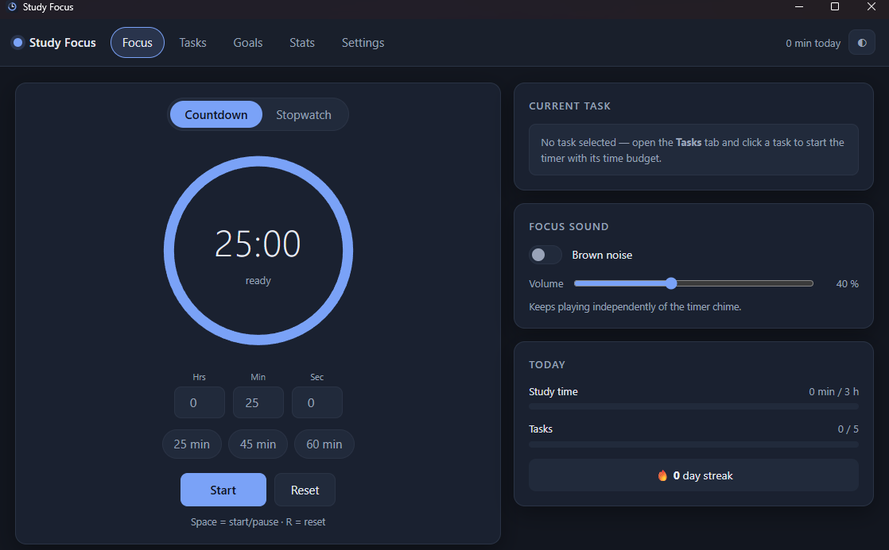

<h1 align="center">Study Focus</h1>

<p align="center">
  Eine ruhige Desktop-App fürs fokussierte Lernen — Timer, Aufgaben mit Zeitvorgabe,
  Ziele, Brown Noise und eine echte Obsidian-Anbindung.<br>
  Läuft nativ unter <b>Windows 11</b> und <b>Kali Linux / Debian</b> — auf Deutsch und Englisch.
</p>

<p align="center">
  
  
  
  
  
  
</p>

<table>
  <tr>
    <td width="50%"></td>
    <td width="50%"></td>
  </tr>
  <tr>
    <td align="center"><sub>Deutsch</sub></td>
    <td align="center"><sub>English</sub></td>
  </tr>
</table>

---

## Warum

Die meisten Lern-Timer sind entweder Webseiten, die beim Tab-Wechsel vergessen werden,
oder Apps, die deine Daten in ihre Cloud schieben. Study Focus ist eine native Desktop-App,
speichert alles lokal — und schreibt deine Lernsessions dahin, wo dein Wissen ohnehin liegt:
**in deinen Obsidian-Vault**.

## Funktionen

### ⏱ Timer
- **Countdown** und **Stoppuhr**, frei einstellbar in Stunden / Minuten / Sekunden
- Presets für den Schnellstart (25 / 45 / 60 min, in den Einstellungen änderbar)
- Start, Pause, Reset — zeitstempelbasiert, läuft also auch nach Systemschlaf genau weiter
- Akustisches Signal (generierter Dreiklang) **und** System-Benachrichtigung bei Ablauf,
  auch wenn das Fenster minimiert ist
- **Restzeit im Fenstertitel und in der Taskleiste**
- Tastenkürzel: `Leertaste` = Start/Pause · `R` = Reset · `Esc` = Dialog schließen

### ✅ Aufgaben mit Zeitvorgabe
- Anlegen, bearbeiten, löschen, abhaken — jede Aufgabe hat eine geschätzte Dauer
- **Klick auf eine Aufgabe startet den Timer direkt mit ihrer Zeitvorgabe**
- Kategorien / Fächer zum Gruppieren, Prioritäten (*wichtig* / *dringend*) mit Farbmarkierung
- Kurzes Notizfeld pro Aufgabe (`#Tags` und `[[Wikilinks]]` erlaubt)
- Fortschrittsanzeige „X von Y Aufgaben erledigt“ und Filter nach Fach / Status

### 🎯 Ziele
- Tages- **und** Wochenziel, jeweils als Lernzeit, Aufgabenzahl oder beides
- Fortschrittsbalken in der Fokus-Ansicht und im Ziele-Tab
- **Streak-Zähler** für aufeinanderfolgende Tage mit erreichtem Tagesziel

### 🗒 Obsidian-Integration
- Vault-Auswahl über den **nativen Ordnerdialog** (kein Browser-Upload)
- Aufgaben als Markdown-Dateien mit YAML-Frontmatter (`tags`, `created`, `time_required`, `done`, …)
- Obsidian-Checkboxen `- [ ]` / `- [x]` — **in Obsidian abgehakt heißt in der App erledigt**
- Nach jeder Session automatisch ein Eintrag in die **Tagesnotiz** (Datum als Dateiname,
  Lernzeit, erledigte Aufgaben, Reflexion), inklusive aufsummierter `lernzeit_minuten`
- Zwei-Wege-Abgleich: gelesen wird beim Start und auf Knopfdruck, geschrieben bei jeder Änderung
- Deine eigenen Frontmatter-Felder bleiben dabei erhalten

### 🎧 Brown Noise
- Bewusst **Brown Noise statt White Noise** — tiefer, weicher, weniger ermüdend
- Komplett im Browser generiert (keine Audiodateien im Repo), nahtlose Schleife
- Ein/Aus-Schalter und Lautstärkeregler, läuft unabhängig vom Timer-Signal weiter

### 💭 Session-Reflexion
- Nach jedem abgeschlossenen Durchlauf optional: „Was hast du gelernt?“ und Fokus 1–5
- Direkt im Dialog die zugehörige Aufgabe als erledigt markieren
- Alles landet in der Obsidian-Tagesnotiz

### 📊 Statistik
- Kennzahlen für heute, diese Woche und gesamt
- Balkendiagramm der letzten 14 Tage (Tage mit erreichtem Ziel eingefärbt)
- **Heatmap über 53 Wochen** im Stil des GitHub-Contribution-Graphen
- Verlauf aller Sessions und **CSV-Export** (Semikolon + BOM, öffnet sauber in Excel)

### 🌍 Zweisprachig
- Komplette Oberfläche auf **Deutsch und Englisch**, umschaltbar ohne Neustart
- Standard richtet sich nach der Systemsprache, lässt sich aber fest einstellen
- Auch die Ausgabe im Vault folgt der Sprache: `## Lernsessions` / `## Study sessions`,
  `priority: wichtig` / `priority: important`
- Bestehende Notizen bleiben nach einem Sprachwechsel lesbar — geschrieben wird in der
  eingestellten Sprache, **gelesen werden beide**

### 🎨 Bedienung
- Klare Trennung zwischen *aktuellem Fokus* (Timer + laufende Aufgabe) und Liste / Statistik
- Dunkel, Hell oder Systemeinstellung
- Responsiv bis ~360 px Fensterbreite, `prefers-reduced-motion` wird respektiert

---

## Installation

### Fertige Pakete

Noch keine Releases veröffentlicht — bis dahin baust du die App in wenigen Minuten selbst.

### Selbst bauen — Voraussetzungen

<details open>
<summary><b>Windows 11</b></summary>

```powershell
winget install Rustlang.Rustup
winget install Microsoft.VisualStudio.2022.BuildTools --override "--wait --passive --add Microsoft.VisualStudio.Workload.VCTools --includeRecommended"
```

WebView2 ist unter Windows 11 bereits vorinstalliert.

Für die Installer-Erzeugung zusätzlich die Tauri-CLI:

```powershell
cargo install tauri-cli --version "^2.0"
```

> **Windows on ARM (Snapdragon):** Die CLI zieht eine Abhängigkeit, die `clang` braucht.
> Vorher `winget install LLVM.LLVM` ausführen, sonst bricht der Build mit
> `failed to find tool "clang"` ab. Zum reinen **Starten** der App ist die CLI nicht nötig.

</details>

<details open>
<summary><b>Kali Linux / Debian / Ubuntu</b></summary>

```bash
sudo apt update
sudo apt install -y libwebkit2gtk-4.1-dev build-essential curl wget file \
  libxdo-dev libssl-dev libayatana-appindicator3-dev librsvg2-dev patchelf

curl --proto '=https' --tlsv1.2 -sSf https://sh.rustup.rs | sh
source "$HOME/.cargo/env"
cargo install tauri-cli --version "^2.0"
```

Für AppImage-Builds zusätzlich `sudo apt install libfuse2`.

</details>

### Starten

Ohne Tauri-CLI — reicht zum Entwickeln und Testen völlig aus:

```bash
cd src-tauri
cargo run
```

Mit CLI, aus dem Projektordner:

```bash
cargo tauri dev
```

Der erste Build dauert einige Minuten, danach startet die App in Sekunden.
**Änderungen unter `src/` brauchen kein Neu-Kompilieren** — Fenster mit `F5` neu laden genügt.

### Release bauen

```bash
cargo tauri build
```

| System | Ergebnis |
|---|---|
| Windows | `src-tauri/target/release/bundle/msi/Study Focus_0.1.0_x64_en-US.msi` |
| Windows | `src-tauri/target/release/bundle/nsis/Study Focus_0.1.0_x64-setup.exe` |
| Linux | `src-tauri/target/release/bundle/deb/study-focus_0.1.0_amd64.deb` |
| Linux | `src-tauri/target/release/bundle/appimage/study-focus_0.1.0_amd64.AppImage` |

Die Architektur im Dateinamen richtet sich nach der Build-Maschine (`x64` bzw. `arm64`).
Cross-Compiling von Windows nach Linux ist mit Tauri nicht vorgesehen — das `.deb`
baust du direkt auf der Kali-Maschine aus demselben Quellordner:

```bash
sudo dpkg -i src-tauri/target/release/bundle/deb/study-focus_0.1.0_amd64.deb
sudo apt -f install   # falls Abhängigkeiten fehlen
```

---

## Obsidian-Integration einrichten

*Einstellungen → Obsidian-Vault → **Ordner wählen*** und dann die Schalter
*Aufgaben als Markdown synchronisieren* und/oder *Sessions in Tagesnotiz schreiben* aktivieren.
Die Zielordner (Standard: `Lernaufgaben` und `Tagesnotizen`) sind frei wählbar und werden
bei Bedarf angelegt.

### So sieht eine Aufgabe im Vault aus

```markdown
---
title: Analysis Kapitel 3 durcharbeiten
tags: [lernaufgabe, Mathe, wichtig]
created: 2026-09-26
time_required: 45min
estimate_seconds: 2700
done: false
priority: wichtig
category: Mathe
app_id: muinxloes7p6gu
---
# Analysis Kapitel 3 durcharbeiten

- [ ] Analysis Kapitel 3 durcharbeiten #Mathe  (~45 min)

## Notiz

Fokus auf Grenzwerte, siehe [[Analysis Mitschrift]]
```

### So sieht eine Tagesnotiz aus

```markdown
---
tags: [tagesnotiz, lernen]
date: 2026-09-26
lernzeit_minuten: 70
sessions: 2
---
# 2026-09-26

## Lernsessions
- **19:05 - 19:30** (25 min) -- [[Analysis Kapitel 3 durcharbeiten]] #Mathe -- Fokus: 4/5
    - Gelernt: Grenzwertsätze wiederholt
    - Erledigt: [[Analysis Kapitel 3 durcharbeiten]]
```

### Sprache im Vault

Die Beschriftungen in den Markdown-Dateien folgen der eingestellten Sprache:

| | Deutsch | English |
|---|---|---|
| Aufgaben-Tag | `#lernaufgabe` | `#study-task` |
| Notiz-Überschrift | `## Notiz` | `## Note` |
| Session-Abschnitt | `## Lernsessions` | `## Study sessions` |
| Summe in der Tagesnotiz | `lernzeit_minuten` | `study_minutes` |
| Priorität | `wichtig` / `dringend` | `important` / `urgent` |

Die Frontmatter-Schlüssel (`title`, `created`, `time_required`, `estimate_seconds`, `done`,
`priority`, `category`, `app_id`) bleiben in beiden Sprachen gleich. Beim Lesen versteht die
App beide Varianten, ein Sprachwechsel verliert also weder erledigte Aufgaben noch die
aufsummierte Lernzeit einer bestehenden Tagesnotiz.

### Konfliktregel

Wer zuletzt geschrieben hat, gewinnt — verglichen werden der Dateizeitstempel im Vault und
der interne Änderungszeitpunkt. Praktisch heißt das: in Obsidian abgehakte Aufgaben und dort
geänderte Titel, Notizen oder Zeitvorgaben übernimmt die App beim nächsten Abgleich; neue
Markdown-Dateien im Aufgabenordner werden als Aufgaben importiert.

---

## Datenspeicherung

Alles liegt lokal, unabhängig vom Vault:

| System | Pfad |
|---|---|
| Windows | `%APPDATA%\de.lernfokus.study-focus\data.json` |
| Linux | `~/.local/share/de.lernfokus.study-focus/data.json` |

Geschrieben wird atomar (erst `.tmp`, dann umbenennen), eine beschädigte Datei wird zur Seite
gelegt statt gelöscht. Die App funktioniert vollständig **ohne** Obsidian-Vault.

---

## Projektstruktur

```
Study-App/
├─ src/                    Frontend — wird 1:1 ausgeliefert, kein Bundler
│  ├─ index.html
│  ├─ styles.css
│  └─ js/
│     ├─ app.js            Einstieg, Views, Einstellungen, Tastenkürzel
│     ├─ timer.js          Timer-Kern (zeitstempelbasiert)
│     ├─ tasks.js          Aufgabenliste + Bearbeiten-Dialog
│     ├─ goals.js          Ziele, Fortschritt, Streak
│     ├─ stats.js          Statistik, Heatmap, CSV
│     ├─ vault.js          Obsidian-Synchronisation
│     ├─ audio.js          Brown Noise + Signalton (Web Audio)
│     ├─ store.js          Zustand + Persistenz
│     ├─ i18n.js           Übersetzungen Deutsch / Englisch
│     └─ util.js           Helfer, Tauri-Bridge, Browser-Fallback
└─ src-tauri/              Rust-Backend
   ├─ src/lib.rs           Tauri-Kommandos
   ├─ src/storage.rs       data.json, atomares Schreiben
   ├─ src/obsidian.rs      Markdown lesen/schreiben, Tagesnotizen (+ Tests)
   ├─ tauri.conf.json      Fenster, CSP, Bundle-Targets
   ├─ capabilities/        Tauri-ACL
   └─ icons/               App-Icons
```

**Bewusste Entscheidung: kein Node.js, kein Bundler.** Das Frontend besteht aus ES-Modulen,
die Tauri über `frontendDist: "../src"` direkt ausliefert. Weniger Abhängigkeiten, schnellerer
Build, kein `node_modules`.

---

## Entwicklung

### Frontend ohne Rust ansehen

```bash
cd src
python -m http.server 8777
```

Dann <http://127.0.0.1:8777> öffnen. In diesem Browser-Modus speichert die App in
`localStorage`; Ordnerdialog, Obsidian-Zugriff und System-Benachrichtigungen bleiben der
Desktop-App vorbehalten — die App weist beim Start darauf hin.

### Tests

Die Obsidian-Logik ist durch Rust-Tests abgedeckt — Frontmatter-Round-Trip, Übernahme der
in Obsidian gesetzten Checkbox, Erhalt eigener Frontmatter-Felder, Summenbildung in der
Tagesnotiz, Bereinigung von Dateinamen sowie die englische Ausgabe und der Sprachwechsel
mitten in einer Tagesnotiz:

```bash
cd src-tauri
cargo test --lib
```

### Auf GitHub veröffentlichen

```bash
git init
git add .
git commit -m "Study Focus: erste Version"
git branch -M main
git remote add origin https://github.com/<dein-name>/study-focus.git
git push -u origin main
```

`src-tauri/target/` ist bereits über `.gitignore` ausgeschlossen.

---

## Fehlersuche

| Symptom | Ursache / Lösung |
|---|---|
| `link.exe not found` | MSVC-Build-Tools fehlen (siehe Voraussetzungen) |
| `failed to find tool "clang"` bei `cargo install tauri-cli` | Windows on ARM: `winget install LLVM.LLVM` |
| `webkit2gtk` nicht gefunden | Unter Debian/Kali `libwebkit2gtk-4.1-dev` installieren |
| Fenster bleibt weiß | Konsolenausgabe prüfen; notfalls in `src-tauri/tauri.conf.json` unter `app.security` testweise `"csp": null` setzen |
| Keine Benachrichtigungen (Windows) | Einstellungen → System → Benachrichtigungen für „Study Focus“ erlauben |
| Keine Benachrichtigungen (Kali) | Notification-Daemon installieren: `sudo apt install libnotify-bin dunst` |
| Kein Ton | Der Audio-Kontext startet erst nach der ersten Klick- oder Tasteneingabe im Fenster |

---

## Roadmap

- [ ] Pomodoro-Automatik (Lern- und Pausenblöcke im Wechsel)
- [ ] Tray-Icon mit Restzeit und Schnellsteuerung
- [ ] Globale Tastenkürzel (Timer steuern, ohne das Fenster zu fokussieren)
- [ ] Obsidian-Ordner live überwachen statt beim Start abzugleichen
- [ ] Weitere Sprachen (die Übersetzungen liegen gesammelt in `src/js/i18n.js`)
- [ ] Signierte Releases für Windows und Linux

## Lizenz

Noch keine Lizenz gewählt. Für ein öffentliches Repository ist **MIT** die naheliegende Wahl —
dafür genügt eine `LICENSE`-Datei im Projektwurzelverzeichnis.
